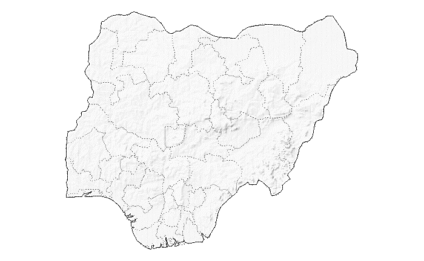
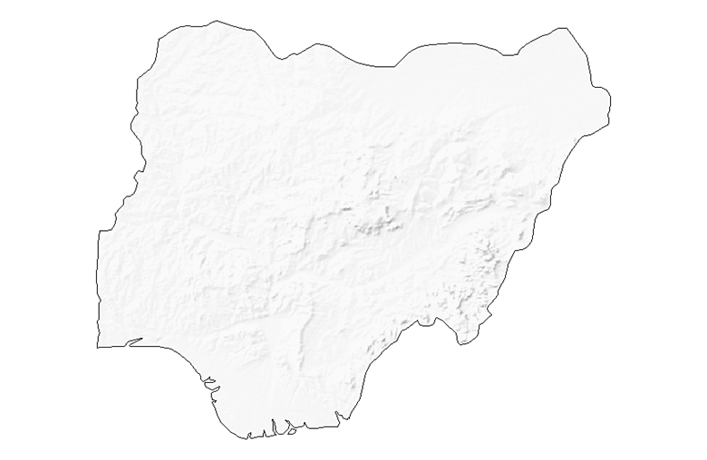
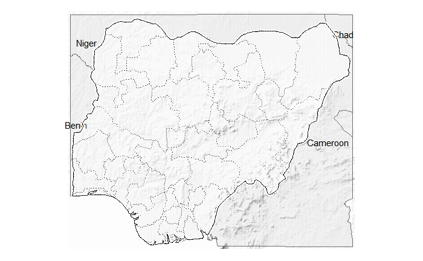

```{r, include = FALSE}
knitr::opts_chunk$set(
  collapse = TRUE,
  comment = "#>",
  warning = FALSE,
  message = FALSE,
  fig.retina = 2
)
```


# Terrain Basemap for thematic mapping

Thematic maps are single-topics maps that focus on the spatial variability of a specific distribution. At USAID's Office of HIV/AIDs, we've used thematic maps to visualize the spatial distibution of HIV/AIDs Programs' key indicators at the PSNU level. ART Saturation of Nigeria at the psnu level is a good example of one of these thematic maps. In most countries, HIV/AIDs programs are implemented only in specific districts by USAID, and creating such a thematic map usually leads to having to deal with empty states. To compensate for the non-presence in some of these districts, we used terrain rasterlayer as a basemap. These basemaps are generated in way to that the hillshape is used as a beautifier of the map.

Below are how we go about creating these basemaps

```{r setup, echo = T, eval = T}
library(dplyr)         # General data munging and visualisation
library(ggplot2)       # General plotting
library(gisr)          # OHA/SI in house package used to create these basemap
library(sf)            # Spatial data management
library(glitr)         # OHA/SI in house package used to help standardize viz
```

We will be using Nigeria as our country of focus. Let's extract the country boundary and the states boundaries.

```{r echo = T, eval = T}

countryname <- "Nigeria"

adm0 <- gisr::get_admin0(countries = countryname) %>% 
  dplyr::select(admin)

adm1 <- gisr::get_admin1(countries = countryname) %>% 
  dplyr::select(name)

```

What does the country map look like?

```{r echo = T, eval = T}
adm0 %>% gisr::gview()
```

What does the states map look like?

```{r warning=FALSE, echo = T, eval = T}
adm1 %>% 
  gisr::gview() + 
  ggplot2::geom_sf_text(data = adm1, ggplot2::aes(label = name), size = 3)
```

Let's create a basemap for Nigeria. 

For this, We will need to downlaod the raster file into `si_path("path_raster")`

This option uses `rnaturalearth` to extract admin0 and admin1 boundaries as `sf` objects.

```{r warning=FALSE, echo = T, eval = F}
terrain_map(countries = countryname, 
            mask = TRUE,
            glamr::si_path("path_raster"))
```


We could also provide you own admins boundaries. This is a classic case where official country names don't match with `rnaturalearth` names. Tanzania is good example where the country name is `United Republic of Tanzania`.

```{r warning=FALSE, echo = T, eval = F}
terrain_map(countries = adm0,
            adm0 = adm0,
            adm1 = adm1,
            terr = glamr::si_path("path_raster"))
```


We could also decide to use only the country boundaries

```{r warning=FALSE, echo = T, eval = F}
terrain_map(countries = adm0,
            adm0 = adm0,
            terr = glamr::si_path("path_raster"))
```




It's also possible to add neighbor countries to your basemap. See below.

```{r warning=FALSE, echo = T, eval = F}
ras <- glamr::si_path("path_raster")

terrain_map(countries = adm0,
            adm0 = adm0,
            adm1 = adm1,
            add_neighbors = TRUE,
            add_labels = TRUE,
            terr = ras)
```

